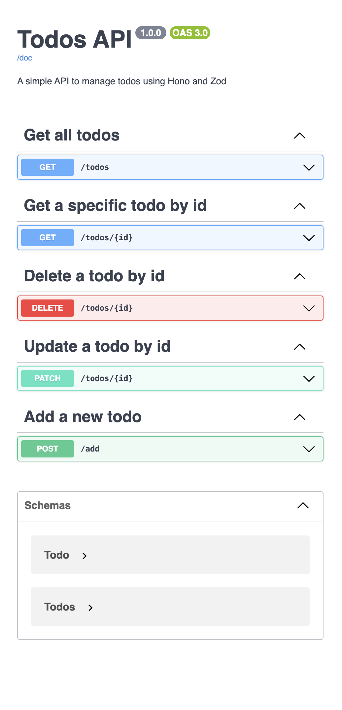
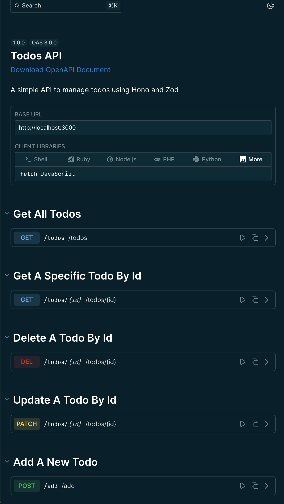

# Hono API

Very simple POC of a rest api using [Hono](https://hono.dev/) with [zod-openapi](https://github.com/honojs/middleware/tree/main/packages/zod-openapi).

_Classic swagger ui_


_Scalar ui_


To install dependencies:

```sh
bun install
```

To run:

```sh
bun run dev
```

open http://localhost:3000
